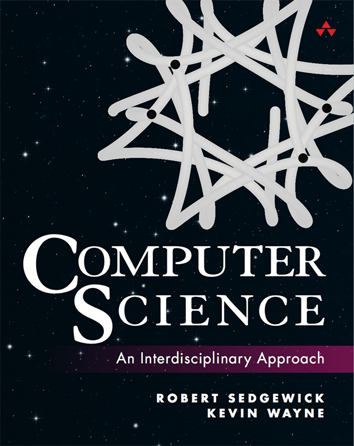

## Overview

This repository contains the C version source code for the  textbook <a href="https://www.pearson.com/en-us/subject-catalog/p/computer-science-an-interdisciplinary-approach/P200000007399?view=educator">Computer Science: An Interdisciplinary Approach</a> written by Robert Sedgewick and Kevin Wayne.

The book is intended for a first course in computer science for the next generation of scientists and engineers, pioneering Princeton computer science professors Robert Sedgewick and Kevin Wayne introduces core Java programming techniques in a scientific context, while also demystifying computation and illuminating its intellectual underpinnings.

You can find and download the original Java code and many other extensive supplementary information, including suggested approaches to programming assignments, checklists, and FAQs, at this companion web <a href="https://introcs.cs.princeton.edu/java/home/">site</a>.

## Index

|                   ELEMENTS OF PROGRAMMING                    | FUNCTIONS | OBJECT ORIENTED PROGRAMMING | DATA STRUCTURES |
| :----------------------------------------------------------: | :-------: | :-------------------------: | :-------------: |
| <a href="introcs/ElementsOfPrograming/HelloWorld.c">HelloWorld.c</a> |           |                             |                 |
| <a href="introcs/ElementsOfPrograming/UseArgument.c">UseArgument.c</a> |           |                             |                 |
|  <a href="introcs/ElementsOfPrograming/Ruler.c">Ruler.c</a>  |           |                             |                 |
| <a href="introcs/ElementsOfPrograming/IntOps.c">IntOps.c</a> |           |                             |                 |
| <a href="introcs/ElementsOfPrograming/Quadratic.c">Quadratic.c</a> |           |                             |                 |
| <a href="introcs/ElementsOfPrograming/LeapYear.c">LeapYear.c</a> |           |                             |                 |
| <a href="introcs/ElementsOfPrograming/RandomInt.c">RandomInt.c</a> |           |                             |                 |
|   <a href="introcs/ElementsOfPrograming/Flip.c">Flip.c</a>   |           |                             |                 |
| <a href="introcs/ElementsOfPrograming/TenHellos.c">TenHellos.c</a> |           |                             |                 |
| <a href="introcs/ElementsOfPrograming/PowersOfTwo.c">PowersOfTwo.c</a> |           |                             |                 |
| <a href="introcs/ElementsOfPrograming/DivisorPattern.c">DivisionPattern.c</a> |           |                             |                 |
| <a href="introcs/ElementsOfPrograming/HarmonicNumber.c">HarmonicNumber.c</a> |           |                             |                 |
|   <a href="introcs/ElementsOfPrograming/Sqrt.c">Sqrt.c</a>   |           |                             |                 |
| <a href="introcs/ElementsOfPrograming/Binary.c">Binary.c</a> |           |                             |                 |
| <a href="introcs/ElementsOfPrograming/Gambler.c">Gambler</a> |           |                             |                 |
| <a href="introcs/ElementsOfPrograming/Factors.c">Factors</a> |           |                             |                 |
|                                                              |           |                             |                 |

## Contribution

This repo is under construction, so any issue reports and code fixes are welcome. If you want to share your C version code, please fork this repo first and submit a PR, but you should guarantee the code's correctness and add appropriate comments.

Finally, if you think this repo does work for you, please give a star✨, I will appreciate your kindness and continue to improve this project.

## Copyright

- The whole C version source code is under <a href="LICENSE">MIT</a> licensed.
- Other materials, including test data, is for self-study only; if you wish to use it for other purposes, please refer to the original author's license and obtain permission to do so.

## Development environment 

IDE: CLion

Systems: Win 11

